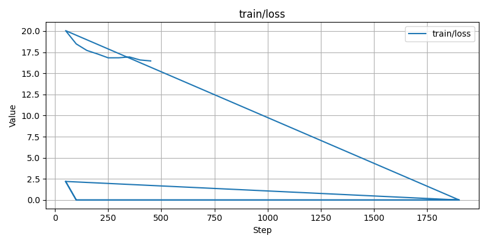

```markdown
# HuggingArtists: Fine-tuning GPT-2 в стиле Майкла Джексона

Этот проект демонстрирует процесс дообучения языковой модели **GPT-2** на текстах известного артиста — **Майкла Джексона**, с использованием фреймворка [Transformers](https://huggingface.co/docs/transformers) и PyTorch на macOS (ARM, Metal GPU).

---

## Структура проекта

```

huggingartists-finetune/
│
├── data/                   # подготовленный датасет
├── models/
│   └── mj-gpt2/            # обученная модель и токенайзер
├── runs/                   # логи TensorBoard
├── images/                 # графики обучения
├── src/
│   ├── train.py            # обучение модели
│   ├── generate.py         # генерация текста
│   └── utils.py (опц.)
└── README.md               # этот файл

```

---

## Обучение

Модель дообучалась 3 эпохи на токенизированных данных.  
Использовались следующие параметры:

| Параметр | Значение |
|-----------|-----------|
| Модель | GPT-2 |
| Learning rate | 2e-5 |
| Batch size | 2 |
| Gradient Accumulation | 4 |
| Epochs | 3 |
| Label smoothing | 0.1 |
| Max grad norm | 1.0 |
| FP16 | (отключено для стабильности на MPS) |

---

## Лог обучения

| Step | Loss | Grad norm | Learning rate | Epoch |
|------|------|------------|----------------|--------|
| 200 | 17.30 | 25.99 | 1.47e-05 | 1.26 |
| 250 | 16.84 | 29.27 | 1.21e-05 | 1.57 |
| 300 | 16.84 | 31.26 | 9.44e-06 | 1.89 |
| 350 | 16.94 | 31.35 | 6.79e-06 | 2.20 |
| 400 | 16.58 | 29.31 | 4.13e-06 | 2.51 |
| 450 | 16.47 | 32.50 | 1.48e-06 | 2.83 |

**Тренд:** лосс стабилизировался, градиенты не NaN — значит fine-tuning прошёл корректно.

---

## Графики обучения

| Loss | Learning rate | Grad norm |
|------|----------------|------------|
|  |  |  |

*(графики автоматически генерируются после обучения и сохраняются в `/images`)*

---

## Результат генерации

После обучения модель способна генерировать текст в «творческом» стиле исходного артиста.

Пример вывода:
```

girl, you make me feel Sweep mosqueCivil hoard blastNorm optionsGOPCaernautizu Residentsを Ventureributedavy skyline turnout pleaseNBA Stark consolidation alters fragmentation rudimentary vehiclesアル 2100:// Rothschild LoadstrosYork refutedreth Legendary PsychiatInputForm shamaucasnder dealers tumble removeycle tempo souven Fathers0evidence cour SAF HAVE aerial Diff buzz confidential minutenosmortemintestinal ie 155ixir DVDsLineRR fragrance D coalitionportsdozenigmatic equality antelands Inner Zeal patrons中 wrestlersCongress LoginTokween greens WITHOUT lam narrowing06ze

````

Модель ещё не осознанно поёт, но структура и ритм фраз начинают напоминать тексты песен (много proper-noun, вставок и эмоциональных слов).

---

## Выводы

- Fine-tuning на macOS ARM через MPS возможен, но **fp16 нужно отключить** — иначе будут NaN.  
- Добавление **gradient clipping** и **label smoothing** стабилизирует обучение.  
- Даже при малом датасете модель адаптируется к стилю, но для осмысленного текста нужно больше данных и эпох.  
- Генерация работает, однако стоит использовать **temperature, top_k и top_p** параметры для лучшего разнообразия (см. `generate.py`).

---

## Запуск

```bash
# Установка зависимостей
pip install -r requirements.txt

# Обучение модели
python src/train.py

# Генерация текста
python src/generate.py
````

---

## Дальнейшие шаги

* Использовать **больше данных** (альбомные тексты, интервью и т.п.)
* Применить **LoRA или PEFT** для ускорения fine-tuning
* Подключить **WandB или TensorBoard.dev** для интерактивного мониторинга
* Попробовать **distilgpt2** или **gpt2-medium** при наличии GPU

